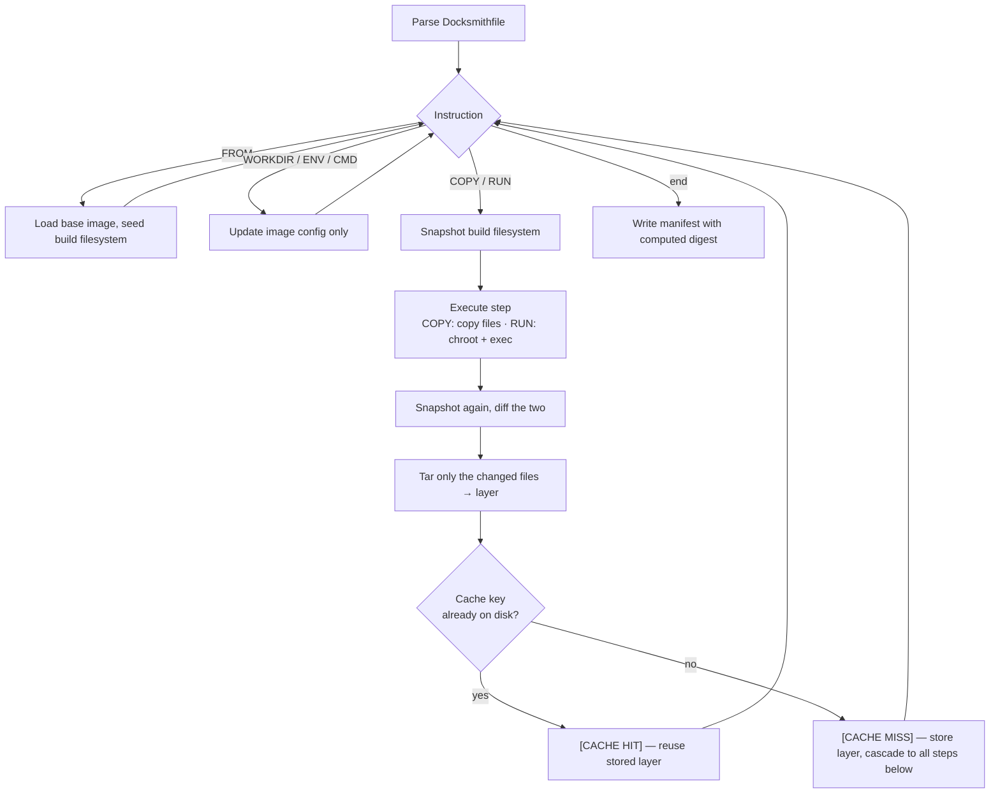

# Docksmith

A miniature Docker, written from scratch in C.

Docksmith builds container images from a `Docksmithfile`, stores them as content-addressed
layers, caches build steps deterministically, and runs the result as a real isolated process
using `chroot(2)`. No daemon, no runtime dependencies, no Docker anywhere in the stack — the
isolation is implemented directly on top of OS primitives.

It was built to answer three questions properly rather than take them on faith:

1. **How does build caching actually work?** What exactly goes into a cache key, and why does
   changing one line of a Dockerfile invalidate everything below it?
2. **How does process isolation work at the OS level?** What does it really mean for a process
   to "see a different filesystem"?
3. **How is an image assembled from layers?** How do a stack of tarballs become a running
   container?

---

## Contents

- [Quick start](#quick-start)
- [How it works](#how-it-works)
  - [The layer store](#the-layer-store)
  - [The build cache](#the-build-cache)
  - [Process isolation](#process-isolation)
- [Docksmithfile reference](#docksmithfile-reference)
- [CLI reference](#cli-reference)
- [Demo walkthrough](#demo-walkthrough)
- [Repository layout](#repository-layout)
- [Requirements](#requirements)
- [Known limitations](#known-limitations)

---

## Quick start

> Docksmith needs **Linux** and **root**. `chroot(2)` is a privileged syscall, and it does not
> exist in a useful form on macOS or Windows. Use a Linux VM (UTM, VirtualBox, VMware, or a
> cloud box). WSL works but has its own quirks around `/proc` and permissions.

```bash
git clone https://github.com/suman184/CC_mini_project-DockSmith-.git
cd CC_mini_project-DockSmith-

./scripts/setup.sh          # checks tools, creates ~/.docksmith, imports base image, compiles

cd examples/demo-app
sudo ../../docksmith build -t myapp:latest .
sudo ../../docksmith run myapp:latest
```

`setup.sh` is a one-time step. After it, everything works fully offline — Docksmith never
touches the network during a build or a run.

---

## How it works

A single binary, no daemon. All state lives on disk under `~/.docksmith/`:

```
~/.docksmith/
├── images/     one JSON manifest per image  (myapp_latest.json)
├── layers/     content-addressed tar files  (<sha256>.tar)
└── cache/      build cache index
```

A build walks the `Docksmithfile` top to bottom. `COPY` and `RUN` each produce a **layer**;
`FROM`, `WORKDIR`, `ENV` and `CMD` only mutate image config.



### The layer store

A layer is a **delta, not a snapshot**. Before each `COPY`/`RUN`, Docksmith walks the build
filesystem and records every file's path, size and mtime. After the step runs, it walks again
and diffs. Only files that were added or modified go into the layer.

That delta is written as a tar archive with deterministic flags:

```
--sort=name --mtime='UTC 1970-01-01' --mode=0755 --owner=0 --group=0
```

This matters more than it looks. Tar records file order, timestamps, ownership and permissions
in the archive header — so without normalising all four, the *same* source files would produce
a *different* tar on every build, the hash would change every time, and the cache would never
hit. Reproducible builds are a prerequisite for a working cache, not a nice-to-have.

The archive is hashed with SHA-256 and stored at `~/.docksmith/layers/<hash>.tar`. Layers are
immutable once written, and identical content maps to one file on disk.

An image is then just a JSON manifest listing its layers in order, plus config:

```json
{
  "name": "myapp",
  "tag": "latest",
  "digest": "sha256:a3f9b2c1...",
  "created": "2026-04-11T10:22:31",
  "layers": ["4f2a...", "9bd1..."],
  "config": {
    "Cmd": "echo Docksmith app running successfully!",
    "WorkingDir": "/app",
    "Env": ["APP_NAME=Docksmith", "APP_VERSION=1.0"]
  }
}
```

The manifest digest is computed on the **canonical form** — the same JSON serialised with
`"digest": ""` — and only then written back with the digest filled in. So the digest is the hash
of the image's content, not a hash of a file that contains its own hash.

### The build cache

Before each layer-producing step, a cache key is derived from everything that could change the
resulting layer:

| Input | Why it's in the key |
|---|---|
| Previous layer's digest | A layer is only meaningful on top of a specific parent. Changing the base image or any earlier step must invalidate this one. |
| Instruction text | `RUN make` and `RUN make test` are different steps. |
| Current `WORKDIR` | The same `RUN` in a different directory does different work. |
| Accumulated `ENV`, sorted by key | `ENV DEBUG=1` changes what a build step produces. Sorting makes the key order-independent. |
| Hash of the step's file content | Editing a source file must invalidate the `COPY` that carries it. |

These are concatenated and hashed. A **cache hit** requires both that the key matches and that
the layer file is still present on disk — a key pointing at a deleted layer is not a hit.

**Cascade rule:** once any step misses, every step below it is forced to miss too. This falls
out of the previous-layer digest being part of the key, and it's the reason editing line 3 of a
Docksmithfile rebuilds lines 3 onward but not lines 1–2.

Every layer-producing step reports its status and the digest it resolved to:

```
Step 2/7 : COPY . /app
-> Handling COPY
  [CACHE MISS]
📦 Layer: sha256:4f2a9c1e...

Step 4/7 : RUN echo "Building application..."
-> Handling RUN
  [CACHE HIT]
📦 Layer: sha256:9bd17ef3...
```

`--no-cache` is not implemented; see [Known limitations](#known-limitations).

### Process isolation

This is the part that makes it a container and not a build script.

`RUN` does **not** execute on the host. Docksmith forks, and in the child:

```c
chdir(rootfs);          // move into the assembled image filesystem
chroot(".");            // make it the process's root — everything above / disappears
chdir("/");             // or chdir(WorkingDir) at run time
execl("/bin/sh", "sh", "-c", cmd, NULL);
```

After `chroot(2)`, the child process's idea of `/` **is** the image filesystem. Paths that
resolve outside it are unreachable — not hidden, not permission-denied, but genuinely
unresolvable, because the kernel resolves them against the new root. The parent `waitpid()`s and
propagates the exit code.

The same primitive backs both `RUN` during a build and `docksmith run`. Skipping isolation during
the build and only applying it at run time would defeat the point: a build step that writes to
the host is a build step that can break the host.

You can verify it directly:

```bash
sudo ./docksmith run myapp:latest "echo proof > /tmp/inside.txt && ls /tmp"
# inside.txt is listed inside the container
ls /tmp/inside.txt
# ls: cannot access '/tmp/inside.txt': No such file or directory
```

The file was written to `<rootfs>/tmp/inside.txt`. It never existed at `/tmp` on the host.

---

## Docksmithfile reference

Six instructions, matching Docker's semantics for each.

| Instruction | Produces a layer? | Behaviour |
|---|---|---|
| `FROM <image>[:<tag>]` | no | Loads a base image from the local store and seeds the build filesystem. Fails with a clear error if the image isn't present. |
| `COPY <src> <dest>` | **yes** | Copies files from the build context into the image, creating missing directories. |
| `RUN <command>` | **yes** | Executes a shell command *inside the assembled image filesystem*, isolated via `chroot`. A non-zero exit aborts the build. |
| `WORKDIR <path>` | no | Sets the working directory for subsequent instructions and for the container at run time. |
| `ENV <key>=<value>` | no | Stores an environment variable in the image config. Injected into every container started from the image. |
| `CMD ["exec", "arg"]` | no | Default command when the container starts. JSON array form. |

Anything else fails immediately with the instruction name and line number.

Example — the demo app, which exercises all six:

```dockerfile
FROM base
COPY . /app
WORKDIR /app
RUN echo "Building application..."
ENV APP_NAME=Docksmith
ENV APP_VERSION=1.0
CMD ["echo", "Docksmith app running successfully!"]
```

---

## CLI reference

| Command | Behaviour |
|---|---|
| `docksmith build -t <name:tag> <context>` | Parses the `Docksmithfile` in `<context>`, executes each step, writes the manifest. Logs every step with its cache status. |
| `docksmith run <name:tag> [cmd]` | Assembles the image filesystem, starts the container in the foreground, waits for exit, prints the exit code. `[cmd]` overrides the image `CMD`. |
| `docksmith run ... -e KEY=VALUE` | Overrides or adds an environment variable. Repeatable. Takes precedence over image `ENV`. |
| `docksmith images` | Lists images in the local store: name, tag, ID, created. |
| `docksmith rmi <name:tag>` | Removes an image manifest. |

**Run builds from inside the context directory.** `COPY` sources and the scratch `temp_fs/`
directory are resolved relative to the current working directory:

```bash
cd examples/demo-app
sudo ../../docksmith build -t myapp:latest .
```

---

## Demo walkthrough

The eight behaviours this project is meant to demonstrate, in order:

```bash
cd examples/demo-app

# 1. Cold build — every layer step reports [CACHE MISS]
sudo ../../docksmith build -t myapp:latest .

# 2. Warm build — every layer step reports [CACHE HIT], returns near-instantly
sudo ../../docksmith build -t myapp:latest .

# 3. Cache invalidation — edit a source file, rebuild.
#    The affected step and everything below it miss; steps above still hit.
echo "# touched" >> app.sh
sudo ../../docksmith build -t myapp:latest .

# 4. List images
sudo ../../docksmith images

# 5. Run the container
sudo ../../docksmith run myapp:latest

# 6. Environment override at run time
sudo ../../docksmith run myapp:latest -e APP_NAME=Overridden

# 7. Prove isolation — the file must not appear on the host
sudo ../../docksmith run myapp:latest "echo proof > /tmp/inside.txt && ls -l /tmp"
ls /tmp/inside.txt     # No such file or directory

# 8. Remove the image
sudo ../../docksmith rmi myapp:latest
```

---

## Repository layout

```
.
├── src/docksmith.c          the entire implementation — CLI, build engine, runtime
├── scripts/
│   ├── setup.sh             one-time setup: prerequisites, store, base image, compile
│   └── base-image.json      base image manifest imported into the local store
├── examples/demo-app/       sample app exercising all six instructions
│   ├── Docksmithfile
│   └── app.sh
├── docs/DOCKSMITH.pdf       original project specification
├── Makefile
└── README.md
```

---

## Requirements

| | |
|---|---|
| OS | Linux (a VM is fine). `chroot(2)` is Linux-only in the form used here. |
| Privileges | root — `chroot(2)` is privileged |
| Toolchain | `gcc` |
| Runtime tools | GNU `tar`, `sha256sum`, `rsync` |

On Debian/Ubuntu:

```bash
sudo apt-get install build-essential rsync coreutils tar
```

`scripts/setup.sh` verifies all of these before compiling.

---

## Known limitations

Documented deliberately — these are the gaps between the current implementation and the full
specification in `docs/DOCKSMITH.pdf`.

**Caching**
- Layers are named by their **cache key hash** rather than by the hash of the tar's own bytes.
  The two are conflated, so the store is keyed correctly but is not strictly content-addressed:
  identical content reached by different build paths produces two files.
- There is no separate `cache/` index. Cache lookup is "does a file with this name exist",
  which works but couples the cache to the layer store.
- The cache key uses the instruction *type* (`"COPY"`, `"RUN"`) rather than the full instruction
  text. Two different `RUN` commands that touch the same files can therefore collide.
- `--no-cache` is not implemented.

**Image format**
- `layers` in the manifest is an array of digest strings, not objects carrying `size` and
  `createdBy`.
- `Cmd` is stored as a flattened string rather than a JSON array.
- `docksmith images` prints the full 64-character digest rather than the 12-character short ID.
- Build output does not include per-step or total timings.

**Build engine**
- `ENV` values are recorded in the image config but are not injected into the environment of
  `RUN` commands during the build.
- `COPY` copies directories via `rsync`; `*` and `**` glob patterns are not supported.
- `WORKDIR` sets image config but does not create the directory in the build filesystem if it
  is missing.
- Change detection compares file size and mtime, not content — a modification that preserves
  both would be missed.

**Runtime**
- `docksmith rmi` removes the image manifest but leaves its layer files on disk.
- The base image is a stub manifest with no layers. `FROM` seeds the build filesystem by copying
  `/bin/sh`, `busybox` and shared libraries **from the host** rather than extracting real base
  image layers. Isolation still holds — the container cannot see the host filesystem — but the
  image is not self-contained the way a real base image would be.
- Library paths are hardcoded for `aarch64` (`/lib/aarch64-linux-gnu/`), with a `/lib64`
  fallback that covers `x86_64`. Other architectures need the paths adjusted in `src/docksmith.c`.

**General**
- Fixed-size buffers throughout, with limits of 100 layers, 10 environment variables and 1000
  files per snapshot. Exceeding them is not always handled gracefully.

Out of scope by design, per the specification: networking, image registries, resource limits,
multi-stage builds, bind mounts, detached containers, and daemon processes.

---

## Credits

Cloud Computing mini-project, PES University.

| Area | |
|---|---|
| Build flow & image creation | Suman |
| Layer system — `COPY`/`RUN`, tar, hashing | Himani |
| Cache, manifest & CLI | Dhruv |
| Process isolation & container runtime | Dishan |

Specification: `docs/DOCKSMITH.pdf`.
